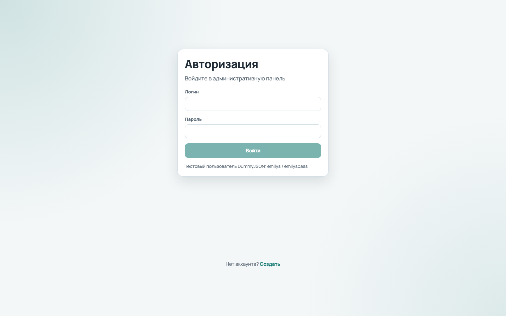
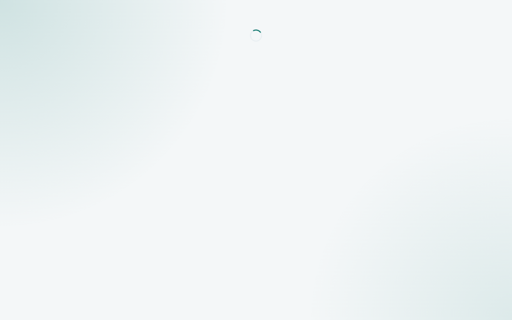
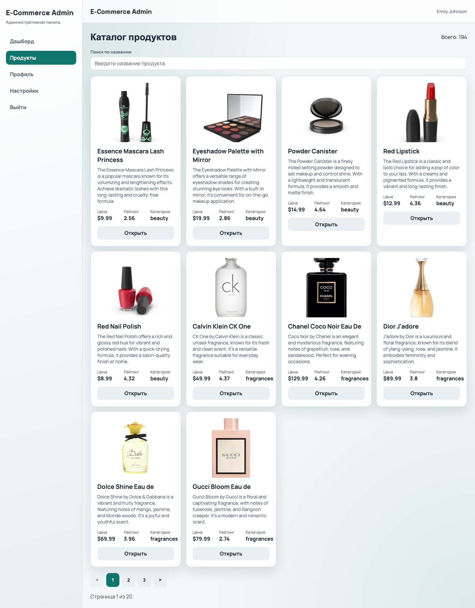
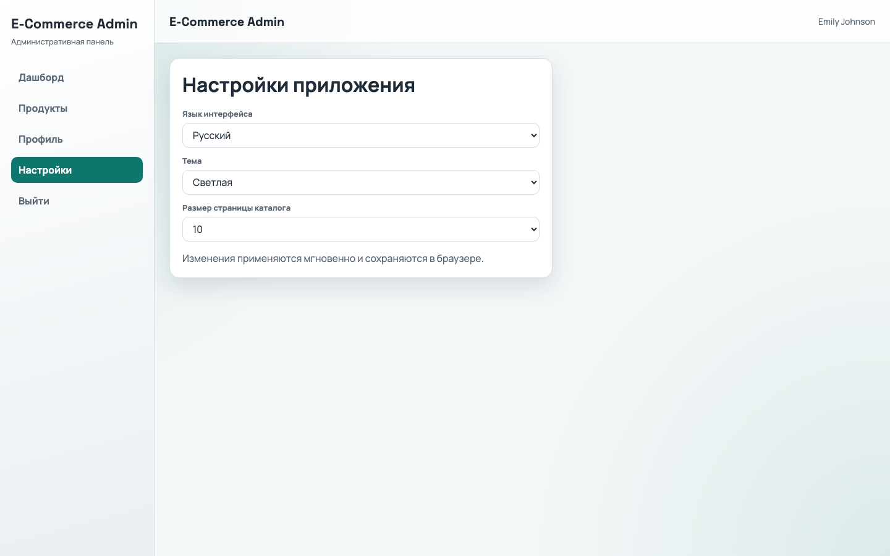

# E-Commerce Admin SPA

SPA административная панель для e-commerce системы на `React + TypeScript` с авторизацией, защищенными маршрутами, каталогом продуктов, настройками интерфейса и i18n.

## Стек

- `React 19`
- `TypeScript`
- `Redux Toolkit`
- `RTK Query`
- `React Router`
- `i18next + react-i18next`
- `Vite`

## Реализованный функционал

### 1. Аутентификация и авторизация

- Логин через `POST /auth/login` (DummyJSON)
- Инициализация текущего пользователя через `GET /auth/me`
- Хранение `accessToken` и `user` в Redux (`auth` slice)
- Persist токена в `localStorage`
- Автовосстановление сессии после перезагрузки
- Logout с полной очисткой сессии и RTK Query cache
- Защищенные маршруты + редиректы:
  - неавторизованный -> `/login`
  - авторизованный на `/login` или `/register` -> `/`

### 2. Маршрутизация и Layout

Публичные:

- `/login`
- `/register` (UI-заглушка)

Приватные:

- `/` (Dashboard)
- `/products`
- `/products/:id`
- `/profile`
- `/settings`
- `/logout`

Дополнительно:

- `*` -> `404`
- Lazy loading всех страниц
- Общий private layout: `Header + Sidebar`

### 3. Каталог продуктов

- Список продуктов (`GET /products`)
- Поиск по названию (`GET /products/search`)
- Детальная карточка (`GET /products/{id}`)
- Пагинация (`limit/skip`) через query params
- Полное покрытие состояний: `loading / error / empty`
- Все запросы только через RTK Query

### 4. Профиль

- Отображение текущего пользователя (`name`, `email`, `username`)
- Выход из системы

### 5. Настройки

- Язык: `ru / en`
- Тема: `light / dark`
- Размер страницы каталога
- Хранение в Redux (`settings` slice)
- Persist в `localStorage`
- Мгновенное применение (язык + тема)

### 6. i18n

- JSON-переводы для `ru` и `en`
- Переведены страницы, формы, ошибки API, пустые состояния
- Переключение языка без перезагрузки

## Архитектура (FSD)

```text
src/
 ├── app/         # providers, router, store, i18n, global styles
 ├── pages/       # route-level pages
 ├── widgets/     # layout и крупные UI-блоки
 ├── features/    # бизнес-фичи (auth, settings, product-catalog)
 ├── entities/    # доменные сущности (user, product)
 └── shared/      # ui-kit, утилиты, base api, config
```

Ключевые правила:

- Бизнес-логика вынесена в `features/*/model`
- API-слой изолирован через `shared/api/baseApi.ts`
- Переиспользуемые UI-компоненты в `shared/ui`
- Глобальная обработка ошибок через `ErrorBoundary`

## Установка и запуск

```bash
npm install
npm run dev
```

Проверка качества:

```bash
npm run lint
npm run build
```

## Тестовые данные для входа

DummyJSON demo user:

- `username: emilys`
- `password: emilyspass`

## Скриншоты ключевых сценариев

### Login



### Dashboard



### Products (search + pagination)



### Settings (theme/language/page size)


