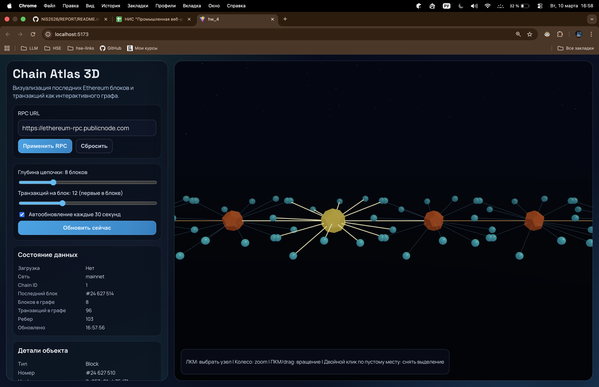

# Визуализация блокчейна в формате 3D-графа

Интерактивное приложение на React, которое отображает последние блоки Ethereum как 3D-граф: блоки связаны цепочкой, а транзакции каждого блока представлены дочерними узлами.

## Список технологий

- React 19 + TypeScript
- Three.js через `@react-three/fiber`
- `@react-three/drei` для камер, линий и фоновых эффектов сцены
- Ethers.js (v6) для загрузки блоков и транзакций через JSON-RPC
- Vite для сборки и разработки

## Памятка по запуску

1. Перейдите в директорию приложения:

```bash
cd hw_4
```

2. Установите зависимости:

```bash
npm i
```

3. (Опционально) задайте RPC endpoint в `.env`:

4. Запустите dev-сервер:

```bash
npm run dev
```

5. Откройте в браузере адрес из терминала (`http://localhost:5173`).

## Скриншот стартовой страницы


